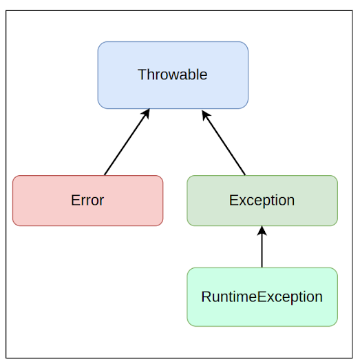

# Integração via APIs
- A integração de sistemas é uma tarefa muito comum, pois permite que os diferentes serviços e aplicações de uma  
  empresa funcionem em conjunto, reaproveitando soluções existentes. Uma das dio.principais maneiras de realizar essa 
  integração  é por meio de APIs.
-  API (Application Programming Interface) é um conjunto de padrões, protocolos e ferramentas para construir 
   software e aplicativos. Uma API permite que diferentes sistemas e serviços se comuniquem e troquem informações de 
   maneira padronizada. Existem diferentes tipos de APIs, sendo que o mais comum é API Web, que utiliza o protocolo 
   HTTP  para comunicação via internet.
- Um exemplo de uso de API é a integração de um sistema de vendas com um sistema de gestão financeira. Por meio de 
  uma API, os dados de venda podem ser enviados automaticamente para o sistema financeiro, evitando a necessidade de 
  inserção manual  e reduzindo o risco de erros. Outro exemplo é o uso de uma API para integração de um aplicativo 
  mobile com um serviço  Web, para sincronização e armazenamento das informações dos usuários.

# O formato JSON
- O JSON (JavaScript Object Notation) é um formato de dados leve e popular para troca de informações entre sistemas, 
  podendo ser utilizado em várias linguagens de programação.
-O JSON é composto por dois tipos de estruturas de dados: objetos e arrays. Um objeto é uma coleção de pares 
  chave-valor, onde as chaves são strings e os valores podem ser strings, números, booleanos, objetos ou arrays.  
  Por exemplo:
{
  "nome": "João",
  "idade": 30,
  "solteiro": false,
  "endereco": {
  "rua": "Rua 123",
  "cidade": "São Paulo",
  "estado": "SP"
  },
  "telefones": [
  "1111-1111",
  "2222-2222"
  ]
}
- Já um array é uma coleção ordenada de valores, que podem ser strings, números, booleanos, objetos ou outros arrays.
  Por exemplo:
[
  {
  "nome": "João",
  "idade": 30
  },
  {
  "nome": "Maria",
  "idade": 25
  },
  {
  "nome": "Pedro",
  "idade": 40
  }
]
- O JSON é amplamente utilizado em aplicações, independente da linguagem de programação utilizada, para enviar e 
  receber dados de APIs, sendo que para isso é recomendado utilizar alguma biblioteca que permita a serialização 
  (conversão de objetos em JSON) e a desserialização (conversão de JSON em objetos).

# O protocolo HTTP
- O HTTP (Hypertext Transfer Protocol) é um protocolo de comunicação que permite a transferência de informações na 
  internet. Ele é a base para a comunicação entre navegadores e servidores Web, sendo utilizado para a transmissão 
  de conteúdo como textos, imagens e vídeos.
- O HTTP foi desenvolvido na década de 1990 e é baseado em um modelo cliente-servidor, onde um cliente (navegador Web)
  faz requisições a um servidor para obter informações, e o servidor responde com os dados solicitados. O HTTP 
  utiliza o TCP (Transmission Control Protocol) como protocolo de transporte para garantir a entrega confiável dos 
  dados.
- O HTTP utiliza métodos para especificar o tipo de operação que deve ser realizada no servidor. Os dio.principais 
  métodos são GET, POST, PUT e DELETE. O método GET é utilizado para solicitar dados do servidor, enquanto o POST é 
  utilizado para enviar informações para o servidor. O PUT é utilizado para atualizar informações no servidor e o 
  DELETE é utilizado para remover informações.
- Além dos métodos, o HTTP utiliza códigos de status para indicar o resultado da operação realizada. Os códigos de 
  status variam de 100 a 599 e são divididos em cinco classes:
- - 1xx: Informações
- - 2xx: Sucesso
- - 3xx: Redirecionamento
- - 4xx: Erro do cliente
- - 5xx: Erro do servidor
- Caso você queira aprofundar os conhecimentos nesse protocolo, recomendamos o nosso curso HTTP: Entendendo a web 
  por baixo dos panos.

# design patterns
- Os padrões de projeto, também conhecidos como design patterns, são soluções reutilizáveis para problemas comuns 
  de desenvolvimento de software. Eles surgiram na década de 1990, quando um grupo de desenvolvedores identificou 
  que muitos projetos de software apresentavam problemas semelhantes, que podiam ser resolvidos por soluções também 
  semelhantes.
- Os padrões de projeto podem ser divididos em três categorias:
- - Padrões de criação: são padrões que lidam com a criação de objetos, visando garantir a flexibilidade e 
    reutilização do código. Alguns exemplos de padrões de criação são: Factory Method, Builder e Singleton.
- - Padrões de estrutura: são padrões que lidam com a organização de objetos em estruturas maiores, buscando 
    simplificar a comunicação entre objetos e reduzir o acoplamento entre eles. Alguns exemplos de padrões de 
    estrutura são: Adapter, Facade e Composite.
- - Padrões de comportamento: são padrões que lidam com a comunicação entre objetos, buscando definir o 
    comportamento esperado em situações específicas. Alguns exemplos de padrões de comportamento são: Observer, 
    Command e Strategy.
- - Ao utilizar padrões de projeto, é possível aumentar a qualidade do código, tornando-o mais legível, flexível e 
    de fácil manutenção.

# Bibliotecas e Frameworks
- Bibliotecas e frameworks em Java, e também em outras linguagens de programação, são ferramentas essenciais para 
  quem trabalha com programação, pois ajudam a reduzir a quantidade de trabalho necessária para construir aplicações,
  uma vez que fornecem funcionalidades prontas para uso, permitindo que as pessoas desenvolvedoras foquem na lógica 
  de negócios dos projetos, ao invés de se preocuparem com problemas técnicos que são comuns e já possuem 
  soluções prontas para uso.
- Em Java, bibliotecas são coleções de classes e interfaces que oferecem uma série de recursos e funcionalidades 
  prontas para uso. Geralmente elas são distribuídas como arquivos JAR (Java Archive), que são pacotes de arquivos 
  Java que contém classes e outros recursos, como imagens e arquivos de configuração. As bibliotecas podem ser 
  importadas em projetos Java e usadas diretamente em código para implementar funcionalidades específicas, como 
  manipulação de arquivos, conexão com bancos de dados, criptografia, etc.
- Frameworks, por outro lado, são estruturas de software que fornecem uma arquitetura básica para o desenvolvimento 
  de aplicações. Eles incluem bibliotecas, padrões e práticas recomendadas para orientar o processo de 
  desenvolvimento de aplicações. Um framework pode ser considerado como uma "fábrica padronizada de aplicações", que 
  fornece os componentes necessários para criar uma aplicação, bem como um conjunto de regras e diretrizes para 
  guiá-lo no processo.
- Existem muitos frameworks populares em Java, cada um com suas próprias características e objetivos. Alguns 
  exemplos incluem o Spring Framework, que é um framework que facilita a criação de aplicações Web e APIs Rest 
  complexas em Java; o Hibernate, que é um framework de mapeamento objeto-relacional e simplifica muito o processo 
  de integração de uma aplicação Java com um banco de dados relacional.

# Java Record
- Lançado oficialmente no Java 16, mas disponível desde o Java 14 de maneira experimental, o Record é um recurso que 
  permite representar uma classe imutável, contendo apenas atributos, construtor e métodos de leitura, de uma 
  maneira muito simples e enxuta.
- Lançado oficialmente no Java 16, mas disponível desde o Java 14 de maneira experimental, o Record é um recurso que 
  permite representar uma classe imutável, contendo apenas atributos, construtor e métodos de leitura, de uma 
  maneira muito simples e enxuta.
- Para se criar uma classe imutável, sem a utilização do Record, era necessário escrever muito código. Vejamos um 
  exemplo de uma classe que representa um telefone:
- 
``` java
  public final class Telefone {

  private final String ddd;
  private final String numero;

  public Telefone(String ddd, String numero) {
  this.ddd = ddd;
  this.numero = numero;
  }

  @Override
  public int hashCode() {
  return Objects.hash(ddd, numero);
  }

  @Override
  public boolean equals(Object obj) {
  if (this == obj) {
  return true;
  } else if (!(obj instanceof Telefone)) {
  return false;
  } else {
  Telefone other = (Telefone) obj;
  return Objects.equals(ddd, other.ddd)
  && Objects.equals(numero, other.numero);
  }
  }

  public String getDdd() {
  return this.ddd;
  }

  public String getNumero() {
  return this.numero;
  }
  }
```
  
- Agora com o Record, todo esse código pode ser resumido com uma única linha:
- `public record Telefone(String ddd, String numero){}`

# Imutabilidade
A imutabilidade, citada anteriormente ao falarmos sobre record, é um conceito importante em Java, que se refere à 
  capacidade de um objeto não poder ser alterado depois de criado. Existem algumas classes que são imutáveis por 
  padrão, como por exemplo, as classes String, Integer, Boolean, entre outras. Isso significa que, uma vez criado um 
  objeto dessas classes, não é possível modificar o seu estado.
Vamos exemplificar. Dado o record abaixo:
- `public record Estudante(String nome, int idade) {}`
- Uma vez criado um objeto Estudante, seus valores não podem ser modificados:
- ``Estudante estudante1 = new Estudante(“Alice”, 19);``
- Observe que após essa criação, eu não consigo setar outro nome ou idade para o objeto estudante1.

`estudante1.setNome(“Maria”); //Essa possibilidade não existe
 estudante1.nome = “Maria”; //Essa possibilidade não existe`
- Qualquer uma das tentativas acima, vai apresentar erro de compilação, pois não possível atribuir nenhum outro nome 
  a variável estudante1.
- Com relação ao record, fica bem claro, certo? Mas e a String, por exemplo? Eu consigo fazer os passos abaixo no 
  código: 
- 
`String nome = “Maria”;
  nome = “Alice”;`
- Se a String é imutável, o certo era eu não conseguir atribuir o conteúdo “Alice” à variável nome, correto?
- No caso da String e de outras classes imutáveis que citei acima, a variável nome contém uma referência ao objeto 
  da classe String que contém o valor "Maria".  
- No entanto, quando você tenta alterar o valor da string, o que realmente acontece é que um novo objeto da classe 
  String é criado com o novo valor e a variável é atualizada para armazenar uma referência ao novo objeto.  
- Por isso, podemos dizer que a classe String é imutável, porque uma vez que um objeto da classe String é criado, 
  ele não pode ser alterado. No entanto, as variáveis que armazenam referências a objetos da classe String podem ser 
  atualizadas para referenciar novos objetos, que são criados a partir do conteúdo do objeto original.    
- A imutabilidade é importante por várias razões, entre elas:
 - - Concorrência: objetos imutáveis são seguros para uso em ambientes concorrentes, já que não há necessidade de 
   sincronização.
 - - Segurança: objetos imutáveis são seguros contra alterações acidentais ou mal-intencionadas.
 - - Desempenho: objetos imutáveis podem ser armazenados em cache e reutilizados, o que pode melhorar o desempenho.

# O bloco finally
- Aprendemos que quando ocorre uma exceção, o Java permite tratar o erro usando a declaração try-catch. Entretanto, 
  existe ainda o bloco finally, que é opcional, mas pode ser útil em certas situações.  
- O finally é usado para executar um bloco de código independentemente de ocorrer uma exceção ou não, ou seja, ele 
  sempre é executado. Isso pode ser útil quando precisamos executar um código tanto no try, caso não ocorra uma 
  exceção, quanto no catch, caso uma exceção seja lançada. Por exemplo, suponha que você tenha o seguinte código:  

```
try {
metodoQuePodeLancarExcecao();
System.out.println("Executou");

System.out.println("Finalizou!");
} catch (Exception e) {
System.out.println("Deu erro!");

System.out.println("Finalizou!");
}
```
- Perceba no código anterior que a instrução `System.out.println("Finalizou!");` deve ser sempre executada, 
  independente de ter acontecido ou exception ou não. Mas o problema é que ela acabou tendo de ser duplicada tanto 
  no try quanto no catch. O bloco finally nos ajuda justamente a evitar essa duplicação de código:   
````
try {
  metodoQuePodeLancarExcecao();
  System.out.println("Executou");
} catch (Exception e) {
  System.out.println("Deu erro!");
} finally {
  System.out.println("Finalizou!");
}

````

- Repare que agora a instrução aparece apenas uma vez, dentro do bloco finally, evitando com isso uma duplicação de 
código desnecessária. 
- O finally é muito utilizado em situações onde é necessário limpar recursos, fechar conexões de banco de dados ou 
  fechar arquivos que foram abertos no bloco try.

### Exceções podem ser previstas, tratáveis e antecipadas.

#  Hierarquia de exceptions no Java
- No Java, as exceções são organizadas em uma hierarquia de classes. Todas as exceções são subclasses da classe 
  **Throwable**, sendo que ela possui duas subclasses principais: **Exception e Error**.

- As exceções que herdam da classe **Exception** são chamadas de exceções verificadas (checked exceptions). Isso 
  significa que essas exceções devem ser tratadas explicitamente em um bloco try-catch ou declaradas em uma cláusula 
  throws na assinatura do método. Um exemplo é a classe de exceção _IOException_, que indica algum problema 
  relacionado com leitura/escrita de dados.   
- As exceções que herdam da classe **Error** representam erros irrecuperáveis pelo sistema, como falta de memória ou 
  falhas internas. Um exemplo é a classe de exceção _OutOfMemoryError_, que indica que o Java não conseguiu memória 
  suficiente do sistema operacional para executar corretamente a aplicação.   
- Além disso, existe ainda a classe de exceção **RuntimeException**, que é uma subclasse direta de **Exception**, e as 
  classes que herdam dela são chamadas de exceções não verificadas (unchecked exception). As exceções não 
  verificadas indicam erros lógicos no código, como a _NullPointerException_, que indica o acesso a algum atributo ou 
  método de um objeto que é nulo, ou seja, que não foi instanciado ou foi atributo ao valor _null_.   
- Ao lidar com exceções em um bloco try-catch, é importante considerar a hierarquia de exceções. É possível capturar 
  exceções de uma classe mãe em um bloco catch que captura exceções de uma classe filha. No entanto, o inverso não é 
  possível. Isso significa que, se um bloco catch captura exceções de uma classe filha, ele não será capaz de 
  capturar exceções de uma classe pai.   

# Multi-catch
- A partir do Java 7, a linguagem introduziu uma nova funcionalidade chamada "multi-catch", que permite capturar 
  várias exceções em um único bloco catch. Essa funcionalidade pode tornar o código mais conciso e legível, 
  reduzindo a repetição de código.  
- O uso de multi-catch é muito simples. Em vez de ter vários blocos catch para lidar com diferentes exceções, você 
  pode agrupá-las em um único bloco usando o caractere | para separar as exceções. Por exemplo, suponha que você 
  tenha escrito o seguinte código: 

````
try {
    metodoQuePodeLancarExcecao();
} catch (NumberFormatException e) {
        System.out.println("tratando erro...");
} catch (IllegalArgumentException e) {
        System.out.println("tratando erro...");
}
````
- Como o tratamento do erro é o mesmo para ambas as exceções, o código anterior poderia ter sido escrito utilizando 
  o multi-catch:  
````
try {
    metodoQuePodeLancarExcecao();
} catch (NullPointerException | IllegalArgumentException e) {
    System.out.println("tratando erro...");
}
````
- No exemplo anterior, estamos lidando com duas exceções diferentes: _NullPointerException_ e _IllegalArgumentException_.
  Se qualquer uma dessas exceções for lançada dentro do bloco try, o mesmo bloco catch será executado.   
- Uma observação importante de lembrar, é que o uso de multi-catch só é permitido para exceções que não estão 
  relacionadas por uma hierarquia de herança. Se duas exceções compartilham uma hierarquia de herança, você deve 
  lidar com elas em blocos catch separados.   

# O pacote java.io
- O Java possui um pacote chamado **java.io**, que é um dos pacotes mais importantes da linguagem, pois fornece classes e 
interfaces para entrada e saída de dados em vários formatos, como arquivos, rede, teclado, dentre outros. Vamos 
conhecer as principais classes desse pacote.

## A classe File
- A classe **File** representa um arquivo ou diretório no sistema de arquivos do computador, permitindo que você crie, 
  delete, liste e manipule arquivos e diretórios. Para criar um objeto _File_, você precisa passar o caminho do 
  arquivo ou diretório como argumento para o construtor. Por exemplo:  
- ````File file = new File("C:\\meuArquivo.txt");````
- No código anterior, foi criado um objeto _File_ que aponta para o arquivo "meuArquivo.txt" localizado na raiz do 
  disco _C_:. 
- A classe File tem vários métodos úteis para interagir com arquivos e diretórios, como _exists()_, _canRead()_,  
  _canWrite()_, _isDirectory()_, _isFile()_, _mkdir()_ e _delete()_.   

## As classes FileReader e FileWriter
-  As classes **FileReader** e **FileWriter** são usadas para ler e escrever dados em arquivos de texto, sendo que a classe 
   **FileReader** lê os caracteres de um arquivo de texto, enquanto a classe **FileWriter** escreve os caracteres. 
- Para usar a classe **FileReader**, você precisa criar um objeto passando um objeto File que deseja ler como argumento. 
  Em seguida, você pode ler os dados do arquivo usando o método _read()_ ou _read(char[])_. Por exemplo: 

````
File file = new File("C:\\meuArquivo.txt");
FileReader reader = new FileReader(file);

int data = reader.read();
while (data != -1) {
System.out.print((char) data);
data = reader.read();
}
reader.close();
````
- No código anterior, é feita a leitura do conteúdo do arquivo "meuArquivo.txt" e seu conteúdo é impresso no console.
- Já a classe FileWriter segue o mesmo processo, porém fazendo o caminho inverso, ou seja, escrevendo caracteres no arquivo. Por exemplo:
````
File file = new File("C:\\saida.txt");
FileWriter writer = new FileWriter(file);
writer.write("Olá, mundo!");
writer.close();
````

- No código anterior, é escrito uma mensagem no arquivo chamado "saida.txt".
## O pacote **java.io** também fornece outras classes úteis, como:
- **BufferedReader** e **BufferedWriter**: são usadas para ler e gravar arquivos de texto de maneira eficiente, lendo e 
  escrevendo uma linha por vez. Elas usam um buffer para armazenar os dados, o que torna a leitura e escrita mais 
  rápida do que quando feita um caractere por vez;   
- **FileInputStream** e **FileOutputStream**: são usadas para ler e gravar dados binários em um arquivo. Eles são usados 
  para ler e gravar dados em arquivos que não são de texto, como imagens e arquivos de áudio;  
- **ObjectInputStream** e **ObjectOutputStream**: são usadas para ler e gravar objetos em arquivos. Isso permite que você 
  armazene objetos Java em arquivos para uso posterior ou para transferência entre diferentes aplicações. 
- Claro, além dessas há também a classe **FileWritter**, que foi utilizada no curso para a escrita simples de um arquivo 
  no computador, e também a classe **Scanner**, que é utilizada para ler arquivos do computador de uma maneira simples e 
  será explicada posteriormente no curso.  
- 