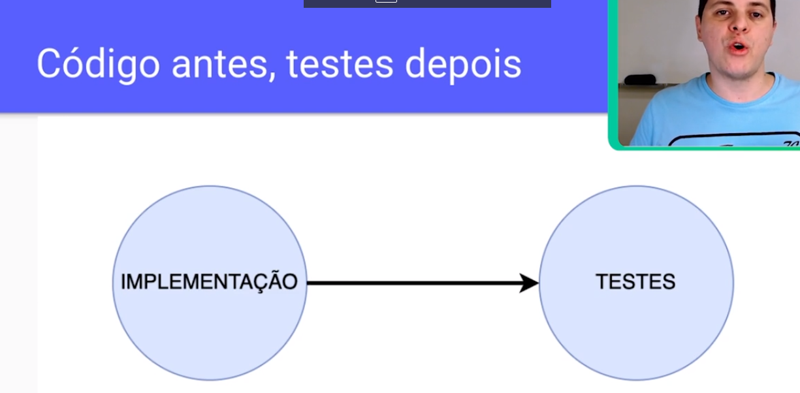
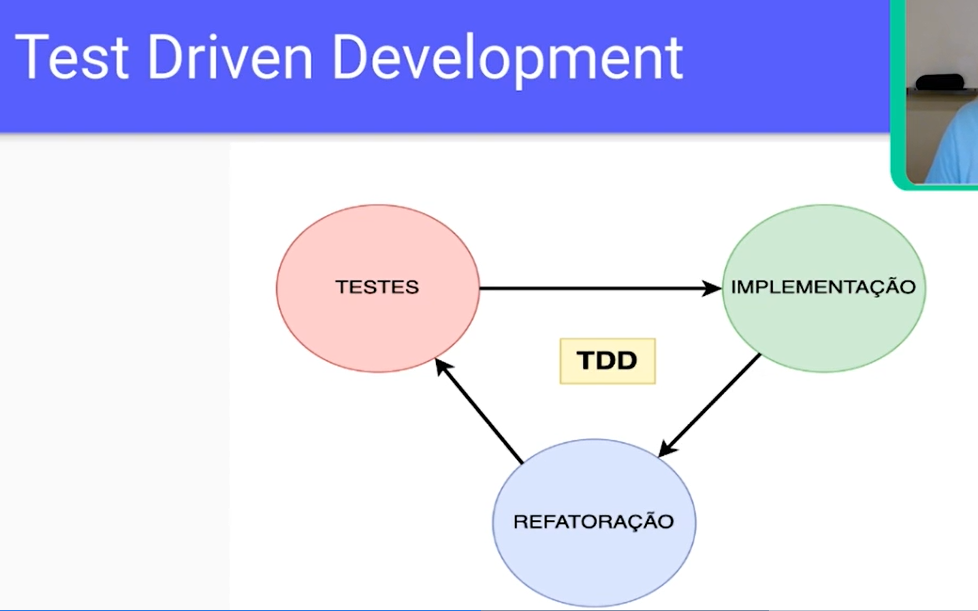

# Design Patterns
- Solução comum para um problema recorrente ao utilizar o paradigma da orientação a objetos.
## Categorias
- Criacionais
- Estruturais
- Comportamentais
- - Strategy
- - Chain of responsibility
- - Template method
- - State
- - Command
- - Observer

## Conhecendo o TDD

