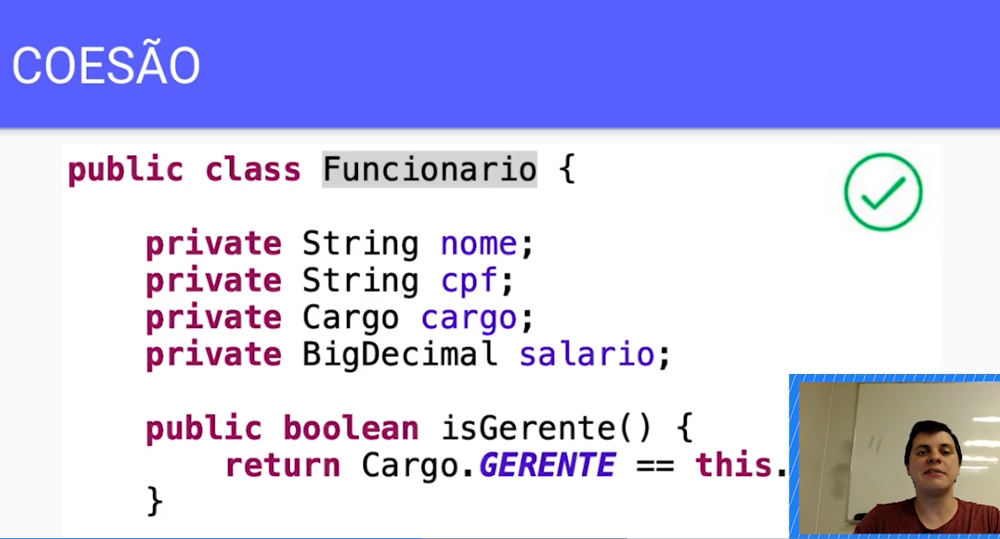
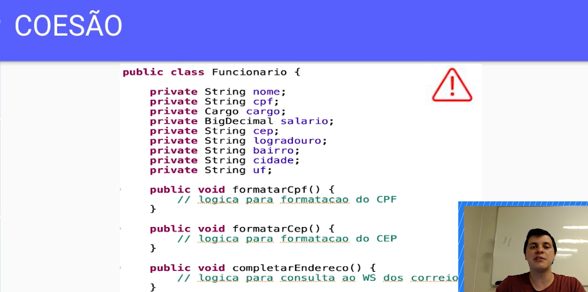
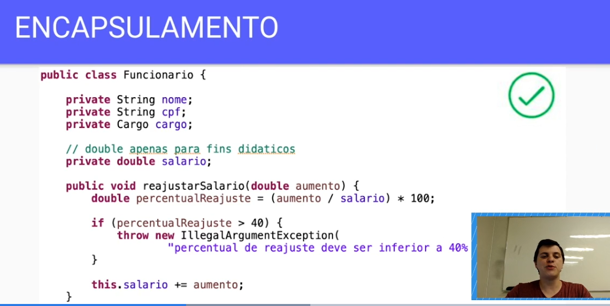
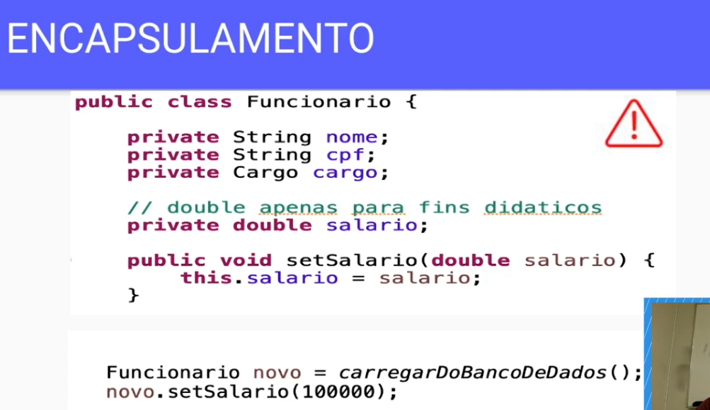
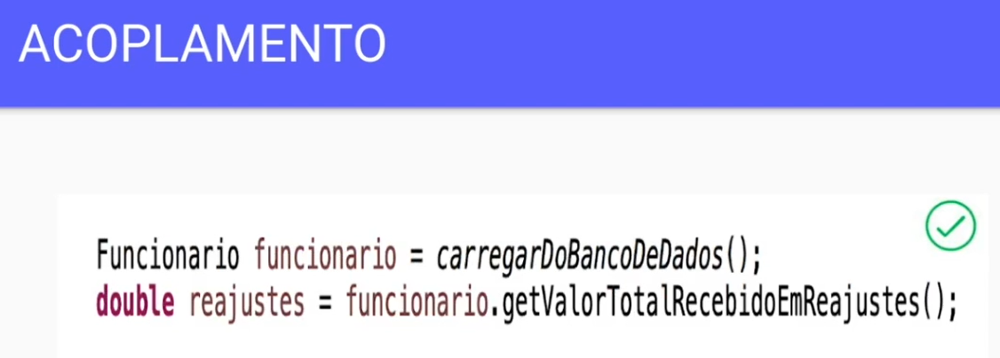
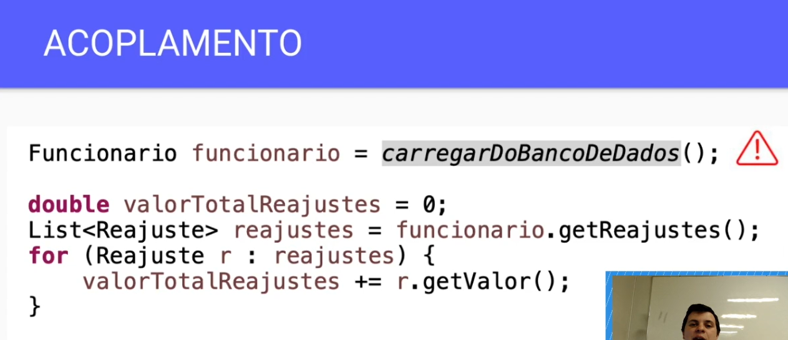

# Solid
- Single Responsibility Principle
- Open Closed Principle
- Liskov Substituion Principle
- Interface Segregation Principle
- Dependency inversion Principle

# Princípios de Orientação a Objetos
- Coesão;
- - União harmônica entre uma coisa e outra.
- - 
- - 
- - Classes não coesas tendem a crescer indefinidamente, o que as tornam difíceis de manter.

- Encapsulamento;
- - Incluir ou proteger alguma coisa numa cápsula (blindar)
- - 
- - 
- - Classes não encapsuladas permitem violação de regras de negócios, além de aumentarem o acoplamento

- Acoplamento
- - Ação de acoplar. Agrupamento aos pares.
- - 
- - 
- - Classes acopladas causam fragilidade no código da aplicação, o que dificulta sua manutenção.

## O que aprendemos?
- Coesão:
- - Uma classe coesa faz bem uma única coisa;
- - Classes coesas não devem ter várias responsabilidades;
- Encapsulamento:
- - Getters e setters não são formas eficientes de aplicar encapsulamento
- - É interessante fornecer acesso apenas ao que é necessário em nossas classes.
- - O encapsulamento torna o uso das nossas classes mais fácil e intuitivo.
- Acoplamento:
- - Acoplamento é a dependência entre classes;
- - Acoplamento nem sempre é ruim, e que é impossível criar um sistema sem nenhum acoplamento;
- - Devemos controlar o nível de acoplamento na nossa aplicação 

## Single Responsibility Principle
- Uma classe deveria ter apenas um único motivo para mudar.

## Open Closed Principle
- Entidades de software (classes, módulos, funções, etc.) devem estar abertas para extensão, porém fechadas para 
  modificações.

## Liskov Substitution Principle
- Se q(x) é uma propriedade demonstrável dos objetos x de tipo T, então q(y) deve ser verdadeiro para objetos y de 
  tipo s, onde S é um subtipo de T.

## Dependency Inversion Principle
- Abstrações não devem depender de implementações. Implementações devem depender de abstrações.

## Interface Segregation Principle
- Uma classe não deveria ser forçada a depender de métodos que não utilizará