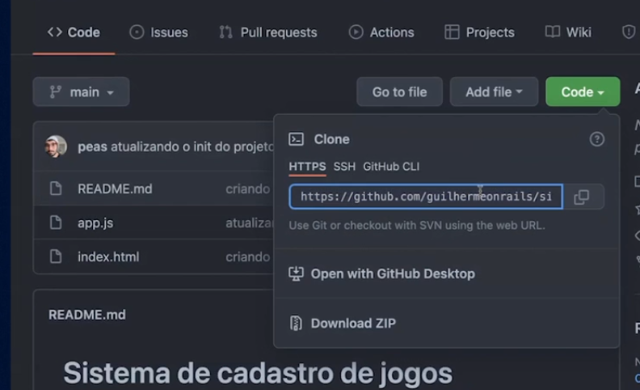

# Clonando um repositório
- 
- Abrir o cmd(terminal) -> Escolher a pasta -> `git clone (nome do repositório copiano como na imagem anterior)`
- Para mostra o histórico -> `` git log`` 
- Para sair escreva a letra ->``q``
- Para limpar o terminal -> ``CTRL + l``
- Mostrando todos os commits em uma única linha -> ``git log --oneline``